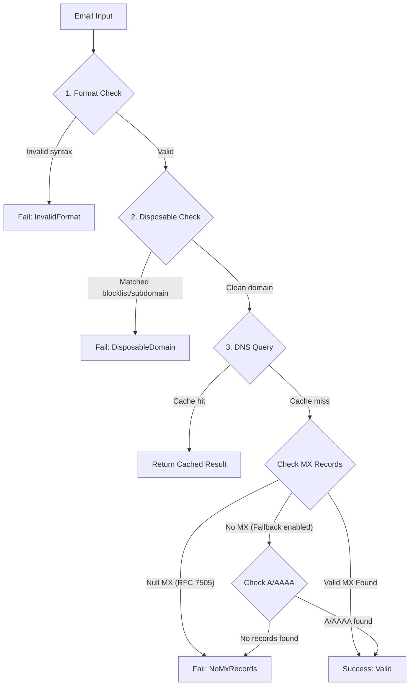

<p align="center">
  
</p>

# EmailDomainValidator

<p align="center">
  <strong>A high-performance, RFC-compliant .NET library for complete email validation: syntax, disposable provider detection, and real DNS MX record verification.</strong>
</p>

<p align="center">
  <a href="https://www.nuget.org/packages/EmailDomainValidator"></a>
  <a href="https://www.nuget.org/packages/EmailDomainValidator"></a>
  <a href="https://dotnet.microsoft.com/"></a>
  <a href="LICENSE.txt"></a>
  <a href="https://github.com/PrinceJK/EmailDomainValidator/actions"></a>
</p>

---

## Table of Contents

- [Why EmailDomainValidator?](#why-emaildomainvalidator)
- [How Validation Works](#how-validation-works)
- [Key Features](#key-features)
- [Installation](#installation)
- [Quick Start](#quick-start)
  - [Dependency Injection (Recommended)](#dependency-injection-recommended)
  - [Static API](#static-api)
- [Real-World Integration Examples](#real-world-integration-examples)
  - [Minimal APIs](#minimal-apis)
  - [Controllers](#controllers)
  - [FluentValidation](#fluentvalidation)
- [Configuration Options](#configuration-options)
- [Disposable Blocklist & Updates](#disposable-blocklist--updates)
- [Performance & Security Architecture](#performance--security-architecture)
- [API Reference](#api-reference)
- [Contributing](#contributing)
- [License](#license)

---

## Why EmailDomainValidator?

Standard .NET validators like `[EmailAddress]` or basic regex patterns only check string formatting. They cannot detect:
- **Throwaway/disposable emails** used for spam, fraud, or fake account signups (`mailinator.com`, `tempmail.com`, etc.).
- **Non-existent or typoed domains** that will bounce immediately (`user@gmailll.com`).
- **Domains that do not accept email** (RFC 7505 Null MX).

`EmailDomainValidator` solves this by running a multi-stage validation pipeline while remaining lightweight, zero-configuration out-of-the-box, and blazingly fast.

---

## How Validation Works



---

## Key Features

- **Format & Syntax Validation**: RFC 5322 compliant, with support for Internationalized Domain Names (IDN/Punycode like `.xn--p1ai`) and checks against consecutive or misplaced dots.
- **5,400+ Embedded Disposable Domains**: Sourced from the active community blocklist, compiled directly into the binary with zero external runtime file dependencies.
- **Subdomain Evasion Protection**: Automatically identifies and blocks throwaway subdomains (e.g. `user@sub.mailinator.com`).
- **Real DNS MX Verification**: Performs DNS MX queries via [DnsClient.NET](https://github.com/MichaCo/DnsClient.NET), filtering out RFC 7505 Null MX records.
- **High Performance**: Powered by .NET 8+ `FrozenSet<string>`, source-generated regular expressions (`[GeneratedRegex]`), and allocation-free domain extraction.
- **Built-in Memory Cache with DoS Protection**: Prevents redundant network queries with configurable TTL and bounded size limits (`CacheSizeLimit`) to protect against memory exhaustion.
- **SSRF & Memory Bomb Hardened**: Remote blocklist updates strictly enforce HTTPS and block private/loopback/cloud-metadata IP ranges.
- **Modern .NET**: Native support for **.NET 8 (LTS)** and **.NET 10**, Native AOT ready.

---

## Installation

Install via the .NET CLI:

```bash
dotnet add package EmailDomainValidator
```

Or via NuGet Package Manager:

```powershell
Install-Package EmailDomainValidator
```

---

## Quick Start

### Dependency Injection (Recommended)

In `Program.cs`:

```csharp
// Register with defaults
builder.Services.AddEmailDomainValidator();

// Or configure options
builder.Services.AddEmailDomainValidator(options =>
{
    options.CacheTtl = TimeSpan.FromHours(2);
    options.BlockDisposableSubdomains = true;
});
```

Inject `IEmailDomainValidator` into your services:

```csharp
public class UserService(IEmailDomainValidator emailValidator)
{
    public async Task<bool> RegisterUserAsync(string email, CancellationToken ct = default)
    {
        ValidationResult result = await emailValidator.ValidateEmailWithResultAsync(email, ct);

        if (!result.IsValid)
        {
            Console.WriteLine($"Registration rejected: {result.FailureReason}");
            return false;
        }

        // Proceed with user registration...
        return true;
    }
}
```

### Static API

For utility scripts, console tools, or background tasks where DI is not available:

```csharp
using EmailDomainValidator;

// Simple boolean validation
bool isValid = await EmailValidator.ValidateEmailAsync("user@gmail.com");

// Detailed validation result
ValidationResult result = EmailValidator.ValidateEmailWithResult("spammer@mailinator.com");

if (!result) // Implicit bool conversion supported
{
    Console.WriteLine($"Failed: {result.FailureReason}"); 
    // Output: Failed: DisposableDomain
}
```

> [!TIP]
> In ASP.NET Core web applications, always prefer the **async** methods (`ValidateEmailAsync`, `ValidateEmailWithResultAsync`) to avoid blocking threadpool threads on DNS network queries.

---

## Real-World Integration Examples

### Minimal APIs

```csharp
app.MapPost("/api/subscribe", async (SubscribeRequest req, IEmailDomainValidator validator, CancellationToken ct) =>
{
    var result = await validator.ValidateEmailWithResultAsync(req.Email, ct);
    if (!result.IsValid)
    {
        return Results.BadRequest(new { error = $"Invalid email: {result.FailureReason}" });
    }

    // Save subscriber...
    return Results.Ok(new { message = "Subscribed successfully" });
});
```

### FluentValidation

```csharp
public class RegisterRequestValidator : AbstractValidator<RegisterRequest>
{
    public RegisterRequestValidator(IEmailDomainValidator emailValidator)
    {
        RuleFor(x => x.Email)
            .NotEmpty()
            .MustAsync(async (email, ct) => await emailValidator.ValidateEmailAsync(email, ct))
            .WithMessage("Please provide a valid, non-disposable email with deliverable mail servers.");
    }
}
```

---

## Configuration Options

Tune library behavior via `EmailValidatorOptions`:

```csharp
builder.Services.AddEmailDomainValidator(options =>
{
    // How long DNS lookup results remain cached (Default: 1 hour)
    options.CacheTtl = TimeSpan.FromHours(1);

    // Maximum cache entries to prevent memory exhaustion (Default: 50,000)
    options.CacheSizeLimit = 50_000;

    // Timeout for DNS queries to prevent threadpool starvation (Default: 3 seconds)
    options.DnsTimeout = TimeSpan.FromSeconds(3);

    // Block subdomains of disposable domains like 'sub.mailinator.com' (Default: true)
    options.BlockDisposableSubdomains = true;

    // Reject RFC 7505 Null MX records (e.g. '0 .') signaling no mail accepted (Default: false)
    options.RejectNullMx = true;

    // Fallback to checking domain A/AAAA records if no MX records exist per RFC 5321 (Default: false)
    options.AllowAddressRecordFallback = false;

    // Maximum download size in bytes for blocklist updates (Default: 10 MB)
    options.MaxBlocklistSizeBytes = 10 * 1024 * 1024;
});
```

---

## Disposable Blocklist & Updates

The library ships with **5,400+ precompiled disposable domains** embedded directly in the binary from [disposable-email-domains](https://github.com/disposable-email-domains/disposable-email-domains).

Since new temporary email services appear regularly, you can refresh the blocklist at runtime without redeploying:

```csharp
await emailValidator.UpdateBlocklistAsync(
    "https://raw.githubusercontent.com/disposable-email-domains/disposable-email-domains/master/disposable_email_blocklist.conf"
);
```

The updated set is swapped in atomically with zero downtime.

> [!NOTE]
> For security, `UpdateBlocklistAsync` enforces HTTPS and automatically blocks loopback (`127.0.0.1`), private networks (`10.x`, `192.168.x`, `172.16.x`), and cloud metadata services (`169.254.169.254`) to prevent Server-Side Request Forgery (SSRF).

---

## API Reference

### `IEmailDomainValidator` and `EmailValidator`

| Method | Return Type | Description |
|---|---|---|
| `IsValidFormat(email)` | `bool` | Validates email syntax against RFC 5322 with IDN support. |
| `IsDisposableEmail(email)` | `bool` | Checks if domain (or parent domain) is on the disposable blocklist. |
| `HasValidMxRecords(email)` | `bool` | Synchronous DNS MX record check (with caching). |
| `HasValidMxRecordsAsync(email, ct)` | `Task<bool>` | Asynchronous DNS MX record check (with caching). |
| `ValidateEmail(email)` | `bool` | Combined check: format + disposable + MX (sync). |
| `ValidateEmailAsync(email, ct)` | `Task<bool>` | Combined check: format + disposable + MX (async). |
| `ValidateEmailWithResult(email)` | `ValidationResult` | Combined check returning detailed `ValidationFailureReason` (sync). |
| `ValidateEmailWithResultAsync(email, ct)` | `Task<ValidationResult>` | Combined check returning detailed `ValidationFailureReason` (async). |
| `UpdateBlocklistAsync(url, ct)` | `Task` | Securely downloads and replaces the active blocklist in memory. |

### `ValidationFailureReason`

```csharp
public enum ValidationFailureReason
{
    None,              // Email passed all checks
    InvalidFormat,     // Failed regex / syntax check
    DisposableDomain,  // Domain is a known throwaway provider
    NoMxRecords        // Domain has no resolvable mail exchanger
}
```

---

## Performance & Security Architecture

| Feature | Implementation | Benefit |
|---|---|---|
| **Set Lookups** | `FrozenSet<string>` (.NET 8+) | \(O(1)\) lookups with zero allocation and optimized hashing. |
| **Domain Parsing** | `ReadOnlySpan<char>` / `IdnMapping` | Zero heap allocations during domain parsing; handles Unicode domains. |
| **Regex Engine** | `[GeneratedRegex]` with 250ms timeout | Compile-time source generation, Native AOT ready, immune to ReDoS. |
| **Cache Safety** | `MemoryCache` with `SizeLimit` + LRU compaction | Immune to cache-flooding memory exhaustion attacks. |
| **SSRF Defense** | Scheme validation & IP filtering | Prevents requests to local ports and cloud metadata services. |
| **I/O Streaming** | `HttpCompletionOption.ResponseHeadersRead` | Streams blocklists line-by-line; prevents memory bombs. |

---

## Contributing

Contributions, bug reports, and suggestions are welcome!
1. Fork the repository.
2. Create a feature branch: `git checkout -b feature/my-feature`.
3. Commit your changes: `git commit -m 'Add awesome feature'`.
4. Push to the branch: `git push origin feature/my-feature`.
5. Open a Pull Request.

---

## License

This project is licensed under the [MIT License](LICENSE.txt).