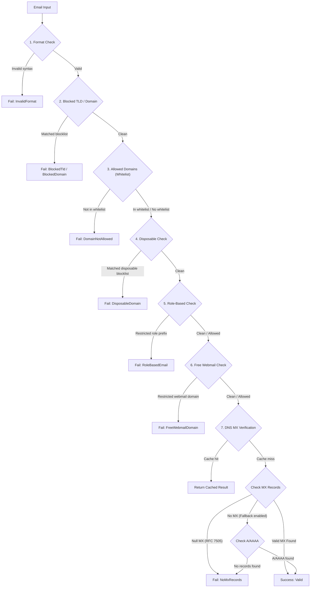

<p align="center">
  
</p>

# EmailDomainValidator

<p align="center">
  <strong>A high-performance, RFC-compliant .NET library for complete email validation: syntax, disposable provider detection, typo suggestions, B2B corporate filters, DataAnnotation attributes, and real DNS MX record verification.</strong>
</p>

<p align="center">
  <a href="https://www.nuget.org/packages/EmailDomainValidator"></a>
  <a href="https://www.nuget.org/packages/EmailDomainValidator"></a>
  <a href="https://dotnet.microsoft.com/"></a>
  <a href="LICENSE.txt"></a>
  <a href="https://github.com/PrinceJK/EmailDomainValidator/actions"></a>
</p>

---

## Table of Contents

- [Why EmailDomainValidator?](#why-emaildomainvalidator)
- [How Validation Works](#how-validation-works)
- [Key Features](#key-features)
- [Installation](#installation)
- [Quick Start](#quick-start)
  - [Dependency Injection (Recommended)](#dependency-injection-recommended)
  - [Static API](#static-api)
- [Advanced Features](#advanced-features)
  - [Domain Typo Correction & Suggestions](#domain-typo-correction--suggestions)
  - [B2B Corporate Email Enforcement (Free & Role-Based Detection)](#b2b-corporate-email-enforcement-free--role-based-detection)
  - [DataAnnotations Model Validation (`[ValidateEmailDomain]`)](#dataannotations-model-validation-validateemaildomain)
  - [Custom Whitelists, Blacklists & TLD Filtering](#custom-whitelists-blacklists--tld-filtering)
  - [High-Throughput Streaming Batch Validation](#high-throughput-streaming-batch-validation)
- [Real-World Integration Examples](#real-world-integration-examples)
  - [ASP.NET Core Model Binding & DTOs](#aspnet-core-model-binding--dtos)
  - [Minimal APIs](#minimal-apis)
  - [FluentValidation](#fluentvalidation)
- [Configuration Options](#configuration-options)
- [Disposable Blocklist & Updates](#disposable-blocklist--updates)
- [Performance & Security Architecture](#performance--security-architecture)
- [API Reference](#api-reference)
- [Contributing](#contributing)
- [License](#license)

---

## Why EmailDomainValidator?

Standard .NET validators like `[EmailAddress]` or basic regex patterns only check string formatting. They cannot detect:
- **Throwaway/disposable emails** used for spam, fraud, or fake account signups (`mailinator.com`, `tempmail.com`, etc.).
- **User typos on popular domains** that will bounce immediately (`user@gamil.com`, `user@hotmial.com`).
- **Free webmail providers** (`gmail.com`, `yahoo.com`) when your SaaS app requires corporate business emails.
- **Shared/role-based mailboxes** (`admin@`, `billing@`, `support@`, `info@`) that hurt marketing campaign deliverability.
- **Domains that do not accept email** (RFC 7505 Null MX).

`EmailDomainValidator` provides a comprehensive, multi-stage validation pipeline while remaining lightweight, zero-configuration out-of-the-box, and blazingly fast.

---

## How Validation Works



> [!NOTE]
> When `EnableTypoSuggestions` is enabled, the typo detection engine runs in parallel using Damerau-Levenshtein distance, automatically attaching `SuggestedDomain` and `SuggestedEmail` to the `ValidationResult`.

---

## Key Features

- **Format & Syntax Validation**: RFC 5322 compliant, with support for Internationalized Domain Names (IDN/Punycode like `.xn--p1ai`) and checks against consecutive or misplaced dots.
- **9,100+ Embedded Disposable Domains**: Compiled directly into the binary with zero external runtime file dependencies.
- **Subdomain Evasion Protection**: Automatically identifies and blocks throwaway subdomains (e.g. `user@sub.mailinator.com`).
- **Domain Typo Detection**: Detects mistyped domains (`gamil.com`, `hotmial.com`, `outlok.com`) and suggests corrections against 50+ popular providers.
- **Free Webmail & Consumer Detection**: Identify consumer addresses (`@gmail.com`, `@yahoo.com`, `@outlook.com`) to enforce business/work emails in B2B applications.
- **Role-Based Email Detection**: Flags generic/shared inboxes (`admin@`, `support@`, `billing@`, `sales@`, `noreply@`, etc.) with sub-addressing support (`support+urgent@`).
- **Custom Whitelists, Blacklists & TLD Rules**: Easily whitelist company domains, block competitor domains, or block risky top-level domains (`.xyz`, `.top`, `.click`).
- **`[ValidateEmailDomain]` DataAnnotation**: Built-in attribute for ASP.NET Core models and DTOs with automatic dependency injection resolution.
- **High-Throughput Batch Validation**: Stream validation over collections with `ValidateBatchAsync` powered by `System.Threading.Channels` and bounded concurrency.
- **Real DNS MX Verification**: Performs DNS MX queries via [DnsClient.NET](https://github.com/MichaCo/DnsClient.NET), filtering out RFC 7505 Null MX records.
- **High Performance & Safety**: Powered by .NET 8+ `FrozenSet<string>`, source-generated regular expressions (`[GeneratedRegex]`), bounded LRU memory caching, and SSRF protections.
- **Modern .NET**: Native support for **.NET 8 (LTS)** and **.NET 10**, Native AOT ready.

---

## Installation

Install via the .NET CLI:

```bash
dotnet add package EmailDomainValidator
```

Or via NuGet Package Manager:

```powershell
Install-Package EmailDomainValidator
```

---

## Quick Start

### Dependency Injection (Recommended)

In `Program.cs`:

```csharp
// Register with defaults
builder.Services.AddEmailDomainValidator();

// Or configure options
builder.Services.AddEmailDomainValidator(options =>
{
    options.CacheTtl = TimeSpan.FromHours(2);
    options.EnableTypoSuggestions = true;
    options.BlockDisposableSubdomains = true;
});
```

Inject `IEmailDomainValidator` into your services:

```csharp
public class UserService(IEmailDomainValidator emailValidator)
{
    public async Task<bool> RegisterUserAsync(string email, CancellationToken ct = default)
    {
        ValidationResult result = await emailValidator.ValidateEmailWithResultAsync(email, ct);

        if (!result.IsValid)
        {
            Console.WriteLine($"Registration rejected: {result.FailureReason}");
            
            // Check for domain typo suggestions
            if (result.SuggestedEmail != null)
            {
                Console.WriteLine($"Did you mean: {result.SuggestedEmail}?");
            }

            return false;
        }

        // Proceed with user registration...
        return true;
    }
}
```

### Static API

For utility scripts, console tools, or background tasks where DI is not available:

```csharp
using EmailDomainValidator;

// Simple boolean validation
bool isValid = await EmailValidator.ValidateEmailAsync("user@gmail.com");

// Detailed validation result
ValidationResult result = EmailValidator.ValidateEmailWithResult("spammer@mailinator.com");

if (!result) // Implicit bool conversion supported
{
    Console.WriteLine($"Failed: {result.FailureReason}"); 
    // Output: Failed: DisposableDomain
}
```

> [!TIP]
> In ASP.NET Core web applications, always prefer the **async** methods (`ValidateEmailAsync`, `ValidateEmailWithResultAsync`) to avoid blocking threadpool threads on DNS network queries.

---

## Advanced Features

### Domain Typo Correction & Suggestions

Catch common typos before emails bounce:

```csharp
var options = new EmailValidatorOptions
{
    EnableTypoSuggestions = true,
    MaxTypoDistance = 2
};

var validator = new EmailDomainValidatorService(options);
var result = validator.ValidateEmailWithResult("alex@gamil.com");

if (result.SuggestedEmail != null)
{
    // SuggestedEmail: "alex@gmail.com"
    // SuggestedDomain: "gmail.com"
    Console.WriteLine($"Did you mean {result.SuggestedEmail}?");
}

// Or call directly:
string? suggestion = EmailValidator.SuggestDomainCorrection("user@hotmial.com");
// Returns: "hotmail.com"
```

### B2B Corporate Email Enforcement (Free & Role-Based Detection)

Restrict signups to corporate business emails:

```csharp
builder.Services.AddEmailDomainValidator(options =>
{
    // Reject consumer webmail addresses (gmail.com, yahoo.com, outlook.com, etc.)
    options.AllowFreeWebmail = false;

    // Reject generic role-based mailboxes (admin@, support@, info@, billing@, etc.)
    options.AllowRoleBasedEmails = false;
});
```

Individual checks are also available:

```csharp
bool isFree = EmailValidator.IsFreeWebmail("user@gmail.com"); // true
bool isRole = EmailValidator.IsRoleBasedEmail("billing+urgent@company.com"); // true
```

### DataAnnotations Model Validation (`[ValidateEmailDomain]`)

Validate incoming DTOs and models declaratively:

```csharp
using System.ComponentModel.DataAnnotations;
using EmailDomainValidator;

public class B2BRegistrationDto
{
    [Required]
    [ValidateEmailDomain(
        AllowFreeWebmail = false, 
        AllowRoleBased = false,
        ErrorMessage = "Please provide an individual corporate email address."
    )]
    public string Email { get; set; } = string.Empty;
}
```

The attribute automatically resolves `IEmailDomainValidator` and its configured options from the application's `IServiceProvider`, falling back to the static validator if DI is unavailable.

### Custom Whitelists, Blacklists & TLD Filtering

Configure precise domain and extension constraints:

```csharp
builder.Services.AddEmailDomainValidator(options =>
{
    // Whitelist: Only permit specific partner domains
    options.AllowedDomains = new HashSet<string>(StringComparer.OrdinalIgnoreCase)
    {
        "partnercorp.com",
        "subsidiary.org"
    };

    // Blacklist: Explicitly block specific competitor domains
    options.BlockedDomains = new HashSet<string>(StringComparer.OrdinalIgnoreCase)
    {
        "competitor.com"
    };

    // Block risky or spam-heavy top-level domains
    options.BlockedTlds = new HashSet<string>(StringComparer.OrdinalIgnoreCase)
    {
        ".xyz",
        ".top",
        ".click"
    };
});
```

### High-Throughput Streaming Batch Validation

Validate large lists of emails asynchronously with bounded concurrency and low memory overhead:

```csharp
var emails = new List<string> { "alice@company.com", "bob@mailinator.com", "carol@gamil.com" };

// Streams results as they finish (e.g. max 20 concurrent DNS workers)
await foreach (ValidationResult result in emailValidator.ValidateBatchAsync(emails, maxConcurrency: 20))
{
    if (result.IsValid)
    {
        Console.WriteLine($"Valid: {result.Email}");
    }
    else
    {
        Console.WriteLine($"Rejected: {result.Email} (Reason: {result.FailureReason})");
    }
}
```

---

## Real-World Integration Examples

### ASP.NET Core Model Binding & DTOs

```csharp
[ApiController]
[Route("api/[controller]")]
public class AccountController : ControllerBase
{
    [HttpPost("register")]
    public IActionResult Register([FromBody] B2BRegistrationDto request)
    {
        // Model validation automatically executed by [ValidateEmailDomain]
        if (!ModelState.IsValid)
            return BadRequest(ModelState);

        return Ok(new { message = "Registration successful" });
    }
}
```

### Minimal APIs

```csharp
app.MapPost("/api/subscribe", async (SubscribeRequest req, IEmailDomainValidator validator, CancellationToken ct) =>
{
    var result = await validator.ValidateEmailWithResultAsync(req.Email, ct);
    if (!result.IsValid)
    {
        return Results.BadRequest(new 
        { 
            error = $"Invalid email: {result.FailureReason}",
            suggestion = result.SuggestedEmail 
        });
    }

    return Results.Ok(new { message = "Subscribed successfully" });
});
```

### FluentValidation

```csharp
public class RegisterRequestValidator : AbstractValidator<RegisterRequest>
{
    public RegisterRequestValidator(IEmailDomainValidator emailValidator)
    {
        RuleFor(x => x.Email)
            .NotEmpty()
            .MustAsync(async (email, ct) => await emailValidator.ValidateEmailAsync(email, ct))
            .WithMessage("Please provide a valid, non-disposable email with deliverable mail servers.");
    }
}
```

---

## Configuration Options

Tune library behavior via `EmailValidatorOptions`:

```csharp
builder.Services.AddEmailDomainValidator(options =>
{
    // --- DNS & Caching ---
    options.CacheTtl = TimeSpan.FromHours(1);            // DNS cache TTL (Default: 1 hour)
    options.CacheSizeLimit = 50_000;                     // Max cache entries (Default: 50,000)
    options.DnsTimeout = TimeSpan.FromSeconds(3);        // DNS lookup timeout (Default: 3 seconds)
    options.RejectNullMx = true;                         // Reject RFC 7505 Null MX (Default: false)
    options.AllowAddressRecordFallback = false;          // Fallback to A/AAAA if no MX (Default: false)

    // --- Disposable & Security ---
    options.BlockDisposableSubdomains = true;            // Block throwaway subdomains (Default: true)
    options.MaxBlocklistSizeBytes = 10 * 1024 * 1024;    // Remote list max download size (Default: 10 MB)

    // --- Typo Suggestions ---
    options.EnableTypoSuggestions = true;                // Suggest corrections for typos (Default: false)
    options.MaxTypoDistance = 2;                         // Max Damerau-Levenshtein distance (Default: 2)

    // --- B2B & List Filtering ---
    options.AllowFreeWebmail = true;                     // Set false to reject @gmail.com, etc. (Default: true)
    options.AllowRoleBasedEmails = true;                 // Set false to reject admin@, etc. (Default: true)
    options.BlockedDomains = null;                       // Set of domains to explicitly block
    options.AllowedDomains = null;                       // Whitelist of allowed domains (if set, others rejected)
    options.BlockedTlds = null;                          // Set of TLDs to block (e.g. [".xyz", ".top"])
});
```

---

## Disposable Blocklist & Updates

The library ships with **9,100+ precompiled disposable domains** embedded directly in the binary from [disposable-email-domains](https://github.com/disposable-email-domains/disposable-email-domains).

Since new temporary email services appear regularly, you can refresh the blocklist at runtime without redeploying:

```csharp
await emailValidator.UpdateBlocklistAsync(
    "https://raw.githubusercontent.com/disposable-email-domains/disposable-email-domains/master/disposable_email_blocklist.conf"
);
```

The updated set is swapped in atomically with zero downtime.

> [!NOTE]
> For security, `UpdateBlocklistAsync` enforces HTTPS and automatically blocks loopback (`127.0.0.1`), private networks (`10.x`, `192.168.x`, `172.16.x`), and cloud metadata services (`169.254.169.254`) to prevent Server-Side Request Forgery (SSRF).

---

## API Reference

### `IEmailDomainValidator` and `EmailValidator`

| Method | Return Type | Description |
|---|---|---|
| `IsValidFormat(email)` | `bool` | Validates email syntax against RFC 5322 with IDN support. |
| `IsDisposableEmail(email)` | `bool` | Checks if domain (or parent domain) is on the disposable blocklist. |
| `IsFreeWebmail(email)` | `bool` | Checks if domain is a known consumer/free email provider. |
| `IsRoleBasedEmail(email)` | `bool` | Checks if local part represents a shared/role-based mailbox. |
| `SuggestDomainCorrection(email)` | `string?` | Returns a suggested domain if a close typo match is detected. |
| `HasValidMxRecords(email)` | `bool` | Synchronous DNS MX record check (with caching). |
| `HasValidMxRecordsAsync(email, ct)` | `Task<bool>` | Asynchronous DNS MX record check (with caching). |
| `ValidateEmail(email)` | `bool` | Combined validation pipeline check (sync). |
| `ValidateEmailAsync(email, ct)` | `Task<bool>` | Combined validation pipeline check (async). |
| `ValidateEmailWithResult(email)` | `ValidationResult` | Detailed validation result with reasons, flags, and suggestions (sync). |
| `ValidateEmailWithResultAsync(email, ct)` | `Task<ValidationResult>` | Detailed validation result with reasons, flags, and suggestions (async). |
| `ValidateBatchAsync(emails, maxConcurrency, ct)` | `IAsyncEnumerable<ValidationResult>` | High-throughput batch streaming validation. |
| `UpdateBlocklistAsync(url, ct)` | `Task` | Securely downloads and replaces the active blocklist in memory. |

### `ValidationFailureReason`

```csharp
public enum ValidationFailureReason
{
    None,               // Email passed all checks
    InvalidFormat,      // Failed regex / syntax check
    DisposableDomain,   // Domain is a known throwaway provider
    NoMxRecords,        // Domain has no resolvable mail exchanger
    BlockedDomain,      // Domain is on custom BlockedDomains list
    DomainNotAllowed,   // Domain is not on custom AllowedDomains whitelist
    BlockedTld,         // Domain uses a forbidden top-level domain
    FreeWebmailDomain,  // Domain is a free webmail provider (AllowFreeWebmail = false)
    RoleBasedEmail      // Local part is a role-based prefix (AllowRoleBasedEmails = false)
}
```

### `ValidationResult`

```csharp
public class ValidationResult
{
    public bool IsValid { get; }
    public ValidationFailureReason FailureReason { get; }
    public string? Email { get; }
    public string? SuggestedEmail { get; }
    public string? SuggestedDomain { get; }
    public bool IsDisposable { get; }
    public bool IsFreeWebmail { get; }
    public bool IsRoleBased { get; }

    public static implicit operator bool(ValidationResult result) => result.IsValid;
}
```

---

## Performance & Security Architecture

| Feature | Implementation | Benefit |
|---|---|---|
| **Set Lookups** | `FrozenSet<string>` (.NET 8+) | \(O(1)\) lookups with zero allocation and optimized hashing. |
| **Domain Parsing** | `ReadOnlySpan<char>` / `IdnMapping` | Zero heap allocations during domain parsing; handles Unicode domains. |
| **Regex Engine** | `[GeneratedRegex]` with 250ms timeout | Compile-time source generation, Native AOT ready, immune to ReDoS. |
| **Cache Safety** | `MemoryCache` with `SizeLimit` + LRU compaction | Immune to cache-flooding memory exhaustion attacks. |
| **SSRF Defense** | Scheme validation & IP filtering | Prevents requests to local ports and cloud metadata services. |
| **I/O Streaming** | `HttpCompletionOption.ResponseHeadersRead` | Streams blocklists line-by-line; prevents memory bombs. |
| **Batch Concurrency** | `System.Threading.Channels` + `Parallel.ForEachAsync` | High throughput with backpressure and low memory footprint. |

---

## Contributing

Contributions, bug reports, and suggestions are welcome!
1. Fork the repository.
2. Create a feature branch: `git checkout -b feature/my-feature`.
3. Commit your changes: `git commit -m 'Add awesome feature'`.
4. Push to the branch: `git push origin feature/my-feature`.
5. Open a Pull Request.

---

## License

This project is licensed under the [MIT License](LICENSE.txt).